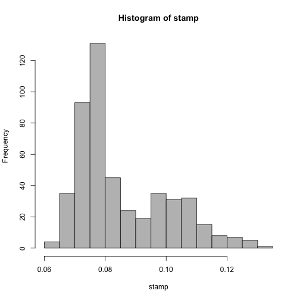
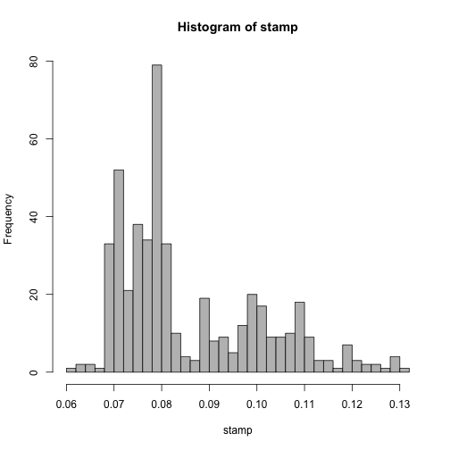
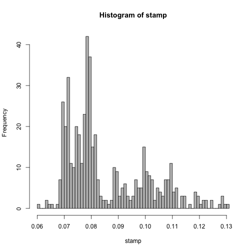
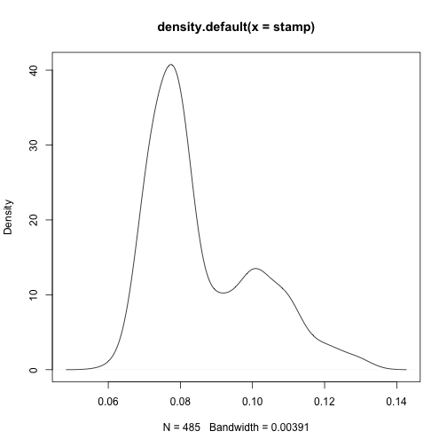
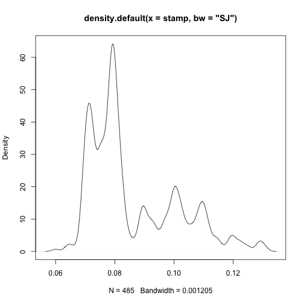
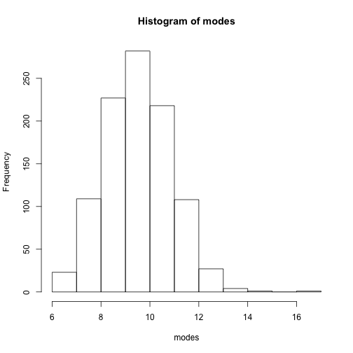

In class boostrap exercise
==========================


Instructions [here](https://docs.google.com/document/d/1mwYOkzZTKgPI-gpoI6UjIVl3mJEglQ1XhULoCst4u_o/edit).


```r
## Load libraries
library(bootstrap)
library(boot)

## Load data
data(stamp)
stamp <- stamp[[1]]
```


# Point 7


```r
## Histograms
hist(stamp, breaks = 20, col = "grey")
```

 

```r
hist(stamp, breaks = 50, col = "grey")
```

 

```r
hist(stamp, breaks = 100, col = "grey")
```

 


```r
## Density
plot(density(stamp))
```

 

```r
plot(density(stamp, bw = "SJ"))
```

 


# Point 8

Think about changing the bandwidth of the density function.


```r
x <- density(stamp, bw = "SJ")
names(x)
```

```
## [1] "x"         "y"         "bw"        "n"         "call"      "data.name"
## [7] "has.na"
```

```r
x$bw
```

```
## [1] 0.001205
```

```r

## localMaxima from Tommy at
## http://stackoverflow.com/questions/6836409/finding-local-maxima-and-minima
localMaxima <- function(x) {
    # Use -Inf instead if x is numeric (non-integer)
    y <- diff(c(-.Machine$integer.max, x)) > 0L
    rle(y)$lengths
    y <- cumsum(rle(y)$lengths)
    y <- y[seq.int(1L, length(y), 2L)]
    if (x[[1]] == x[[2]]) {
        y <- y[-1]
    }
    y
}

## Number of modes
length(localMaxima(x$y))
```

```
## [1] 9
```

```r

## X-coord of the modes
x$x[localMaxima(x$y)]
```

```
## [1] 0.06006 0.06465 0.07139 0.07935 0.08961 0.10048 0.10951 0.11961 0.12910
```


# Point 9: write function

One way to bootstrap. Use the original bandwidth from the SJ method, bootstrap the data and using localMaxima find how many modes there are. Lets do that.


```r

## Re-sample data
B <- 1000
set.seed(20130312)
data <- sapply(1:B, function(x) sample(stamp, replace = TRUE))

## Set bw
bw <- density(stamp, bw = "SJ")$bw

## Find modes function
nModes <- function(x, bw) {
    d <- density(x, bw = bw)
    length(localMaxima(d$y))
}

## Find the modes
modes <- apply(data, 2, nModes, bw = bw)
```


Doing it with the boot package


```r
nModes.boot <- function(x, i) {
    d <- density(x[i], bw = bw)
    length(localMaxima(d$y))
}
set.seed(201303122)
modes.boot <- boot(stamp, nModes.boot, 1000)
boot.ci(modes.boot)
```

```
## Warning: bootstrap variances needed for studentized intervals
```

```
## Warning: extreme order statistics used as endpoints
```

```
## BOOTSTRAP CONFIDENCE INTERVAL CALCULATIONS
## Based on 1000 bootstrap replicates
## 
## CALL : 
## boot.ci(boot.out = modes.boot)
## 
## Intervals : 
## Level      Normal              Basic         
## 95%   ( 5.963, 10.529 )   ( 6.000, 10.000 )  
## 
## Level     Percentile            BCa          
## 95%   ( 8, 12 )   ( 7, 10 )  
## Calculations and Intervals on Original Scale
## Warning : BCa Intervals used Extreme Quantiles
## Some BCa intervals may be unstable
```


# Point 10: CI


```r
## Explore the result
hist(modes)
```

 

```r

## Confidence interval: non-parametric
quantile(modes, c(0.025, 0.975))
```

```
##  2.5% 97.5% 
##     8    12
```

```r

## Using boot pkg
boot.ci(modes.boot)
```

```
## Warning: bootstrap variances needed for studentized intervals
```

```
## Warning: extreme order statistics used as endpoints
```

```
## BOOTSTRAP CONFIDENCE INTERVAL CALCULATIONS
## Based on 1000 bootstrap replicates
## 
## CALL : 
## boot.ci(boot.out = modes.boot)
## 
## Intervals : 
## Level      Normal              Basic         
## 95%   ( 5.963, 10.529 )   ( 6.000, 10.000 )  
## 
## Level     Percentile            BCa          
## 95%   ( 8, 12 )   ( 7, 10 )  
## Calculations and Intervals on Original Scale
## Warning : BCa Intervals used Extreme Quantiles
## Some BCa intervals may be unstable
```


# Point 11: smallest bw with 1 mode


```r
bws <- seq(1e-05, 0.03, by = 1e-05)
one <- sapply(bws, function(x) {
    nModes(stamp, x)
})

## Find smallest bw
h <- bws[which(one == 1)[1]]
h
```

```
## [1] 0.00672
```


