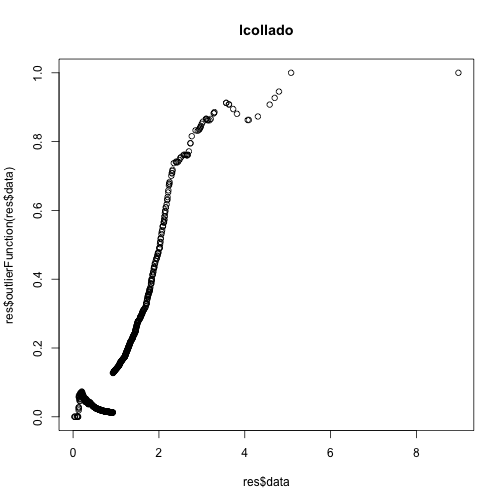

Run Jeff outliers function
============================


```r
## Do F-dist, n = 20, df1 = 5, df2 = 20


## Source myOutliers.R
source("../../../jhsph753/assignments/myOutliers.R")

## Generate data
set.seed(907)
data <- matrix(rf(n = 20 * 40, df1 = 5, df2 = 20), ncol = 40)

if (FALSE) {
    ## Run Jeff's function
    res <- myOutliers(data)
    ## Save data
    save(res, file = "res.Rdata")
}
## Load the data once I've found the outliers
load("res.Rdata")

## Make a plot of the outliers
plot(res$data, res$outlierFunction(res$data), main = "lcollado")
```

 


