Initial EDA
===========


```r
## Load data
load("../../data/process/first.Rdata")
load("../../data/process/second.Rdata")
load("../../data/process/full.Rdata")
load("../../data/process/gameFirst.Rdata")
load("../../data/process/gameFull.Rdata")

## Fix names
names(gameFirst) <- names(first)
names(gameFull) <- names(full)

## Load libraries
library(car)
```

```
## Loading required package: MASS
```

```
## Loading required package: nnet
```


```r
## Quick look at 2002 data
plot(first[[1]]$oPassYdsAtt, second[[1]]$oPassYdsAtt)
abline(a = 0, b = 1, col = "red")
```

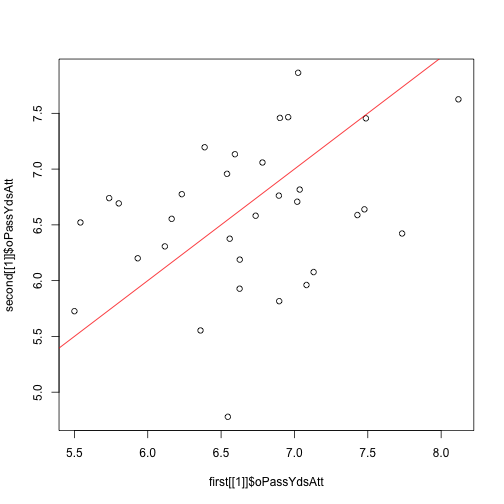 

```r
plot(first[[1]]$oPassYdsAtt, full[[1]]$oPassYdsAtt)
abline(a = 0, b = 1, col = "red")
```

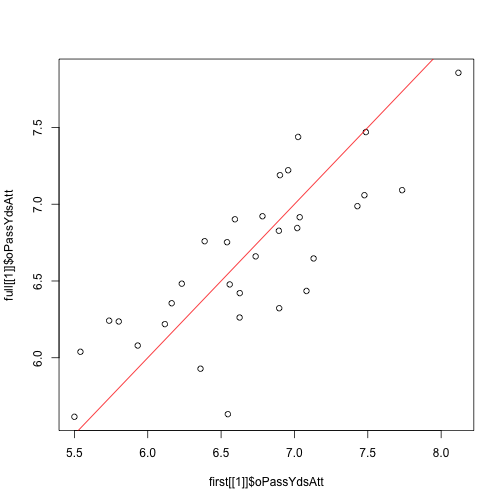 


```r
## Compare all first vs 2nd half for all years (oPassYdsAtt)
oPass <- lapply(1:length(first), function(i) {
    tmp <- first[[i]]$oPassYdsAtt - second[[i]]$oPassYdsAtt
    data.frame(diff = tmp, year = rep(names(first)[i], length(tmp)))
})
oPass <- do.call(rbind, oPass)
plot(oPass$year, oPass$diff)
```

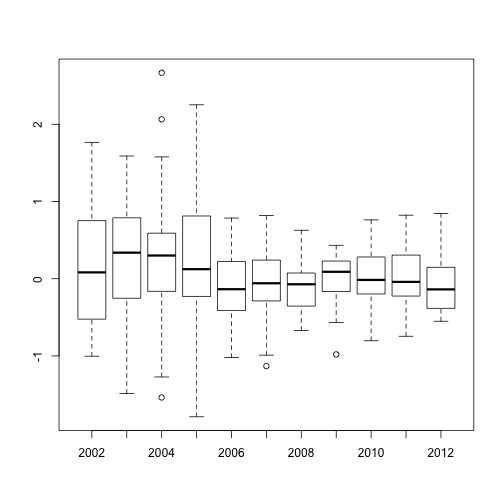 

```r
set.seed(20130318)
plot(jitter(as.integer(oPass$year)), oPass$diff)
```

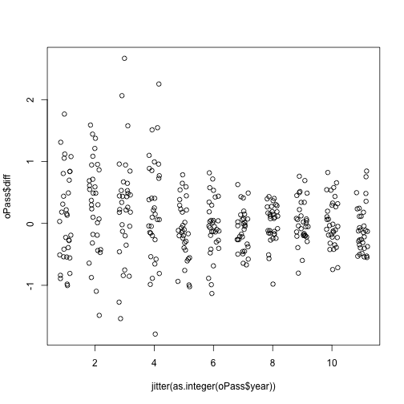 


```r

## Lets make the same plot for all the differences between 1st half - 2nd
## half
getDiffs <- function(var) {
    res <- lapply(1:length(first), function(i) {
        tmp <- first[[i]][, var] - second[[i]][, var]
        data.frame(diff = tmp, year = rep(names(first)[i], length(tmp)))
    })
    res <- do.call(rbind, res)
}
vars <- colnames(first[[1]])[2:ncol(first[[1]])]
allDiffs <- lapply(vars, getDiffs)
names(allDiffs) <- vars


for (y in names(allDiffs)) {
    plot(allDiffs[[y]]$year, allDiffs[[y]]$diff, main = y)
    set.seed(20130318)
    plot(jitter(as.integer(allDiffs[[y]]$year)), allDiffs[[y]]$diff, main = y)
}
```

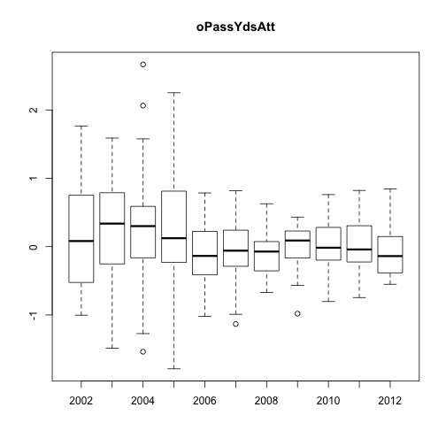 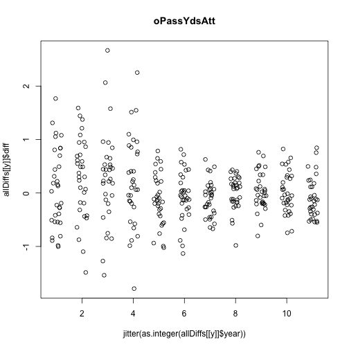 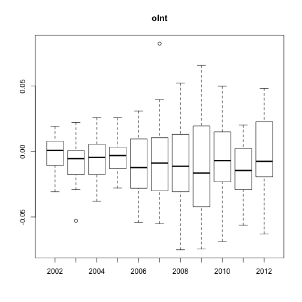 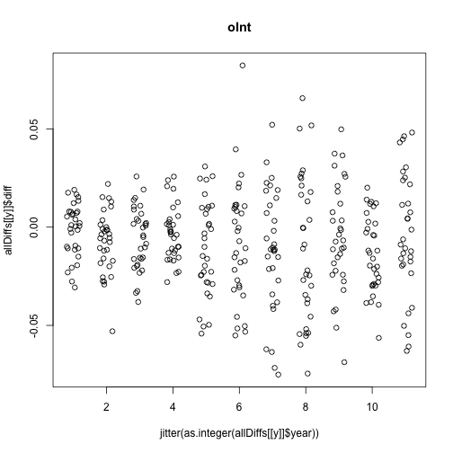 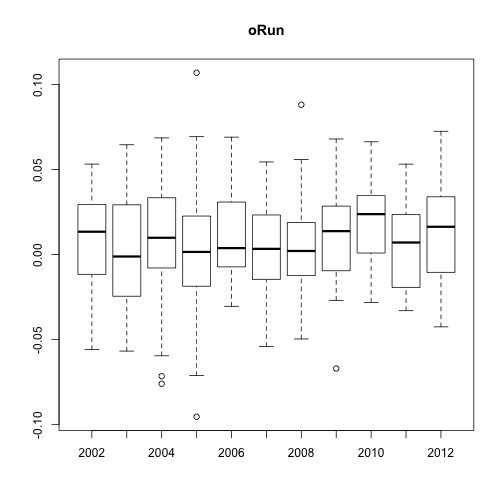 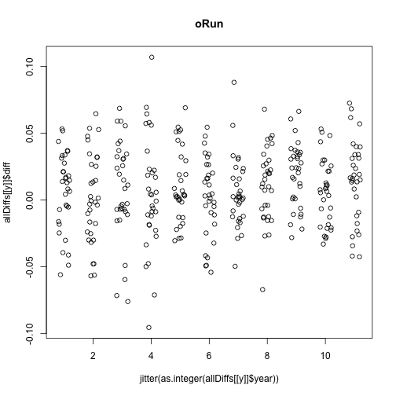 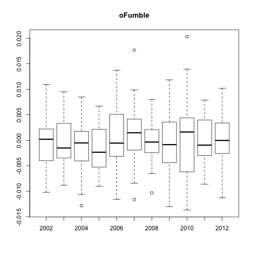 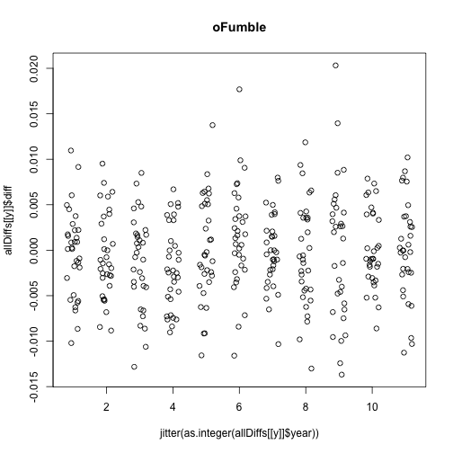 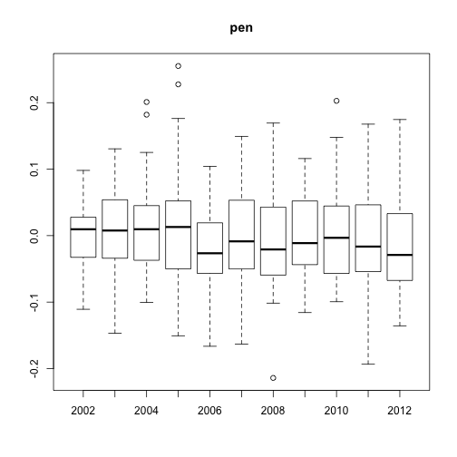 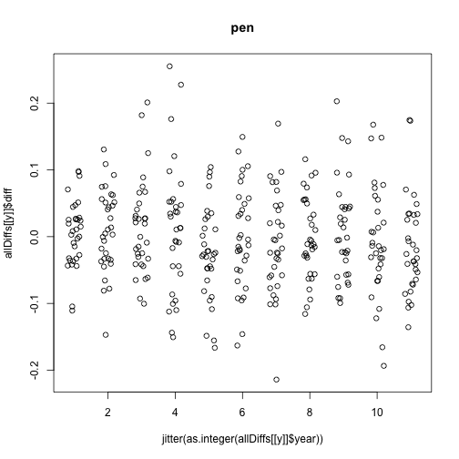 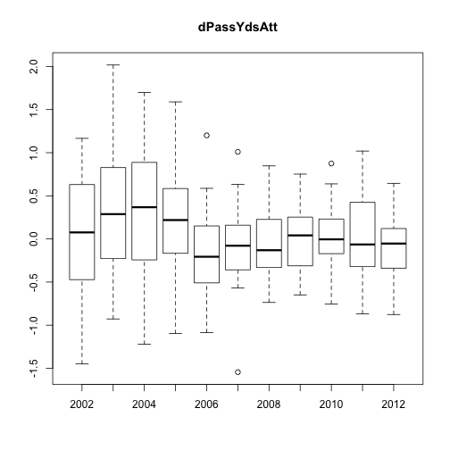 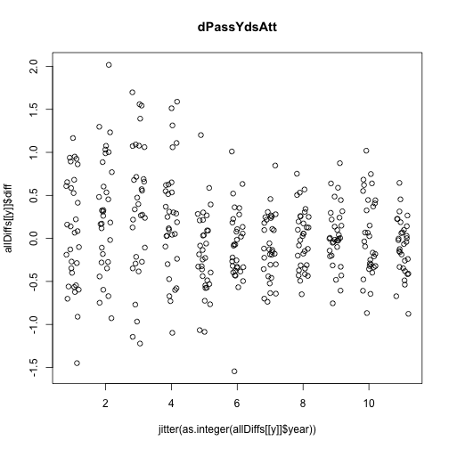 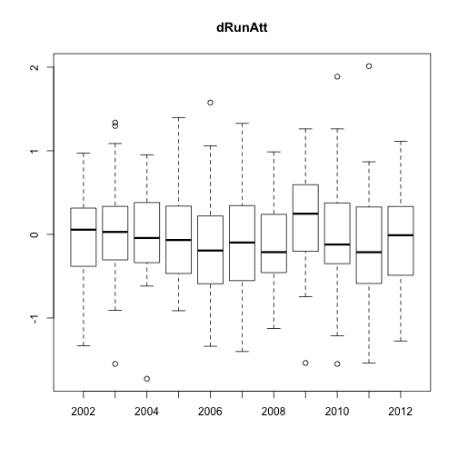  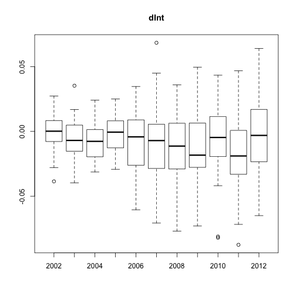 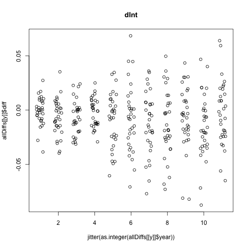 

```r

## We can see how the variables have different patterns over the years.
## For example, oPassYdsAtt decreases in variability over the years, but
## dInt increases
```


```r
## Next, I show huge scatterplot matrices for teamA and then for team B

## teamA first
for (y in c("2002", "2012")) {
    scatterplotMatrix(~win + halfdiff + date + teamAoPassYdsAtt + teamAoInt + 
        teamAoRun + teamAoFumble + teamApen + teamAdPassYdsAtt + teamAdRunAtt + 
        teamAdInt + gameA + gwrA, data = gameFirst[[y]], reg.line = FALSE, spread = FALSE, 
        main = y)
}
```

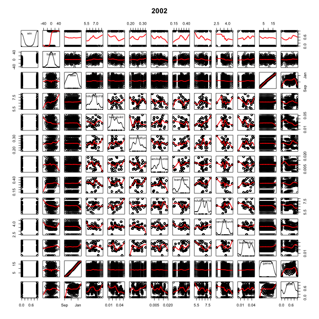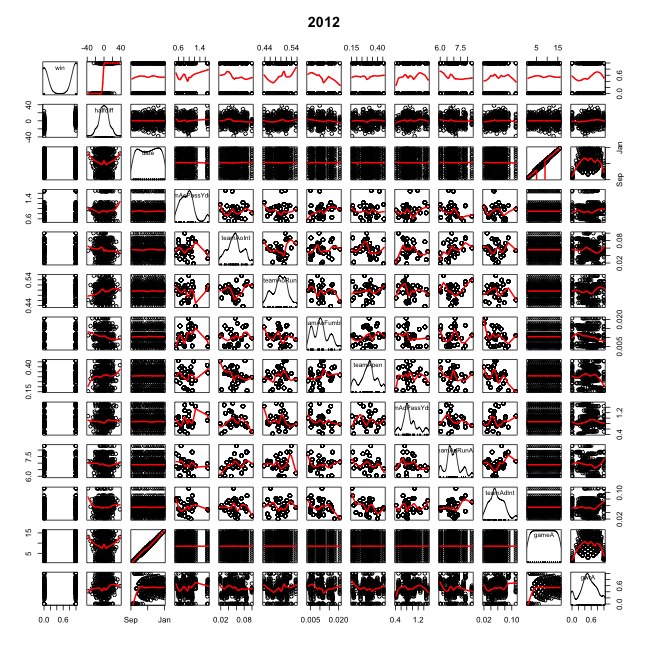


```r
## teamB
for (y in c("2002", "2012")) {
    scatterplotMatrix(~win + halfdiff + date + teamBoPassYdsAtt + teamBoInt + 
        teamBoRun + teamBoFumble + teamBpen + teamBdPassYdsAtt + teamBdRunAtt + 
        teamBdInt + gameB + gwrB, data = gameFirst[[y]], reg.line = FALSE, spread = FALSE, 
        main = y)
}
```

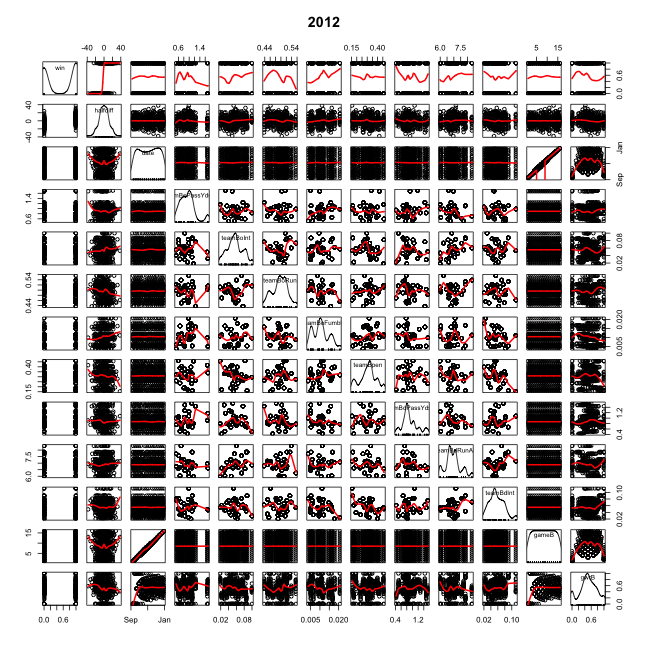


```r

## Group 2002 to 2011
gameFi2011 <- do.call(rbind, gameFirst[as.character(2002:2011)])
scatterplotMatrix(~win + date + halfdiff + teamAoPassYdsAtt, data = gameFi2011, 
    reg.line = FALSE, spread = FALSE, main = "2002 to 2011")
```

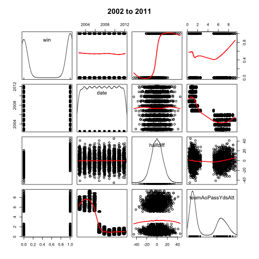 

```r

## Use only 2006 to 2011 data as 2002 to 2005 is quite different
gameFi2011 <- do.call(rbind, gameFirst[as.character(2006:2011)])

summary(gameFi2011)
```

```
##  teamAoPassYdsAtt   teamAoInt         teamAoRun      teamAoFumble    
##  Min.   :0.265    Min.   :0.00806   Min.   :0.424   Min.   :0.00204  
##  1st Qu.:0.806    1st Qu.:0.04430   1st Qu.:0.476   1st Qu.:0.00899  
##  Median :1.000    Median :0.05785   Median :0.494   Median :0.01113  
##  Mean   :1.091    Mean   :0.05950   Mean   :0.494   Mean   :0.01197  
##  3rd Qu.:1.220    3rd Qu.:0.07407   3rd Qu.:0.516   3rd Qu.:0.01538  
##  Max.   :5.092    Max.   :0.14151   Max.   :0.560   Max.   :0.02916  
##                                                                      
##     teamApen      teamAdPassYdsAtt  teamAdRunAtt    teamAdInt     
##  Min.   :0.0905   Min.   :0.362    Min.   :5.35   Min.   :0.0155  
##  1st Qu.:0.2313   1st Qu.:0.818    1st Qu.:6.40   1st Qu.:0.0431  
##  Median :0.2842   Median :1.022    Median :6.72   Median :0.0575  
##  Mean   :0.2894   Mean   :1.086    Mean   :6.73   Mean   :0.0594  
##  3rd Qu.:0.3510   3rd Qu.:1.231    3rd Qu.:7.04   3rd Qu.:0.0722  
##  Max.   :0.5000   Max.   :4.556    Max.   :8.39   Max.   :0.1373  
##                                                                   
##  teamBoPassYdsAtt   teamBoInt         teamBoRun      teamBoFumble    
##  Min.   :0.265    Min.   :0.00806   Min.   :0.424   Min.   :0.00204  
##  1st Qu.:0.806    1st Qu.:0.04430   1st Qu.:0.476   1st Qu.:0.00899  
##  Median :1.000    Median :0.05785   Median :0.494   Median :0.01113  
##  Mean   :1.091    Mean   :0.05950   Mean   :0.494   Mean   :0.01197  
##  3rd Qu.:1.220    3rd Qu.:0.07407   3rd Qu.:0.516   3rd Qu.:0.01538  
##  Max.   :5.092    Max.   :0.14151   Max.   :0.560   Max.   :0.02916  
##                                                                      
##     teamBpen      teamBdPassYdsAtt  teamBdRunAtt    teamBdInt     
##  Min.   :0.0905   Min.   :0.362    Min.   :5.35   Min.   :0.0155  
##  1st Qu.:0.2313   1st Qu.:0.818    1st Qu.:6.40   1st Qu.:0.0431  
##  Median :0.2842   Median :1.022    Median :6.72   Median :0.0575  
##  Mean   :0.2894   Mean   :1.086    Mean   :6.73   Mean   :0.0594  
##  3rd Qu.:0.3510   3rd Qu.:1.231    3rd Qu.:7.04   3rd Qu.:0.0722  
##  Max.   :0.5000   Max.   :4.556    Max.   :8.39   Max.   :0.1373  
##                                                                   
##    local            win             halfdiff        date           
##  Mode :logical   Mode :logical   Min.   :-45   Min.   :2006-09-07  
##  FALSE:1599      FALSE:1493      1st Qu.: -7   1st Qu.:2007-11-11  
##  TRUE :1599      TRUE :1701      Median :  0   Median :2009-09-10  
##  NA's :0         NA's :4         Mean   :  0   Mean   :2009-05-10  
##                                  3rd Qu.:  7   3rd Qu.:2010-11-14  
##                                  Max.   : 45   Max.   :2012-02-05  
##                                  NA's   :12                        
##   resumes           teamA              teamB               gameA      
##  Mode :logical   Length:3198        Length:3198        Min.   : 1.00  
##  FALSE:1597      Class :character   Class :character   1st Qu.: 5.00  
##  TRUE :1597      Mode  :character   Mode  :character   Median : 9.00  
##  NA's :4                                               Mean   : 8.86  
##                                                        3rd Qu.:13.00  
##                                                        Max.   :20.00  
##                                                                       
##       gwrA           gameB            gwrB      
##  Min.   :0.000   Min.   : 1.00   Min.   :0.000  
##  1st Qu.:0.333   1st Qu.: 5.00   1st Qu.:0.333  
##  Median :0.500   Median : 9.00   Median :0.500  
##  Mean   :0.507   Mean   : 8.86   Mean   :0.506  
##  3rd Qu.:0.714   3rd Qu.:13.00   3rd Qu.:0.714  
##  Max.   :1.000   Max.   :20.00   Max.   :1.000  
##  NA's   :28                      NA's   :28
```

```r

scatterplotMatrix(~win + date + halfdiff + teamAoPassYdsAtt, data = gameFi2011, 
    reg.line = FALSE, spread = FALSE, main = "2006 to 2011")
```

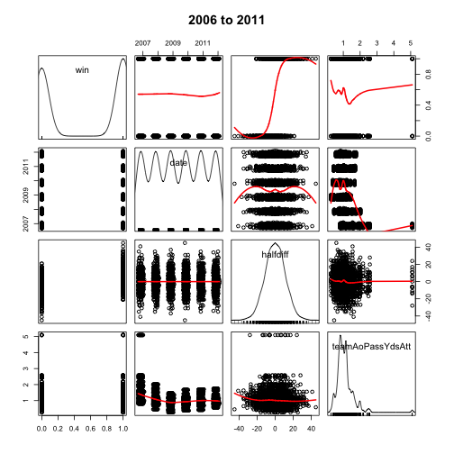 

```r

scatterplotMatrix(~win + date + teamAoInt, data = gameFi2011, reg.line = FALSE, 
    spread = FALSE, main = "2006 to 2011")
```

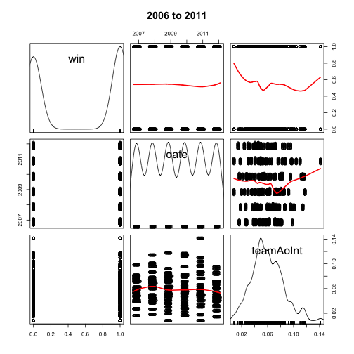 

```r

scatterplotMatrix(~win + teamAoRun, data = gameFi2011, reg.line = FALSE, spread = FALSE, 
    main = "2006 to 2011")
```

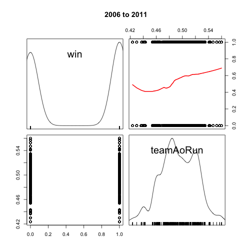 

```r

scatterplotMatrix(~win + teamAoFumble, data = gameFi2011, reg.line = FALSE, 
    spread = FALSE, main = "2006 to 2011")
```

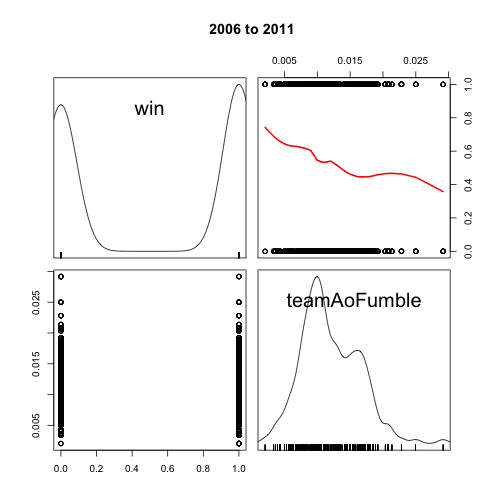 

```r

scatterplotMatrix(~win + teamApen, data = gameFi2011, reg.line = FALSE, spread = FALSE, 
    main = "2006 to 2011")
```

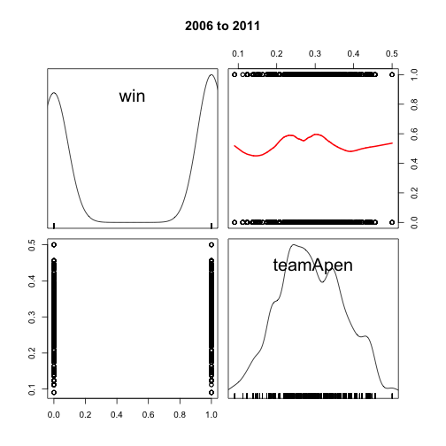 

```r

scatterplotMatrix(~win + teamAdPassYdsAtt, data = gameFi2011, reg.line = FALSE, 
    spread = FALSE, main = "2006 to 2011")
```

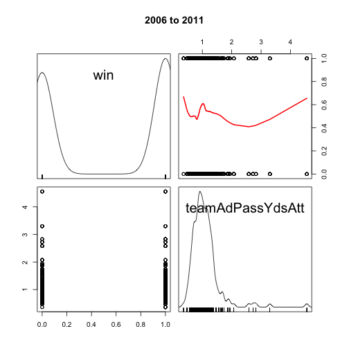 

```r

scatterplotMatrix(~win + teamAdRunAtt, data = gameFi2011, reg.line = FALSE, 
    spread = FALSE, main = "2006 to 2011")
```

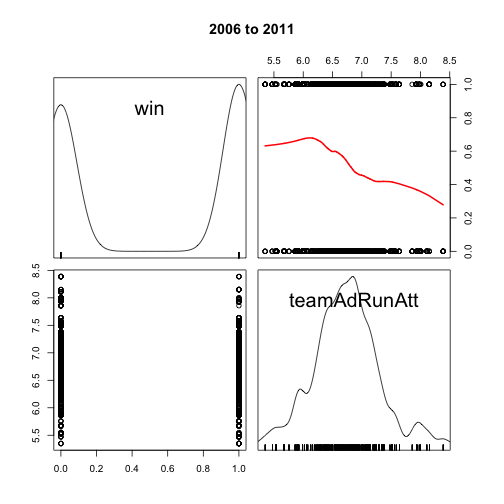 

```r

scatterplotMatrix(~win + teamAdInt, data = gameFi2011, reg.line = FALSE, spread = FALSE, 
    main = "2006 to 2011")
```

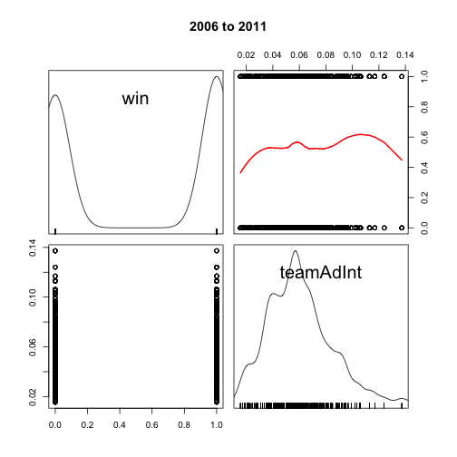 

```r

scatterplotMatrix(~win + gameA + gwrA + gwrB, data = gameFi2011, reg.line = FALSE, 
    spread = FALSE, main = "2006 to 2011")
```

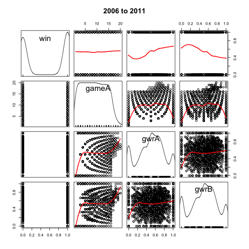 


