Getting a prediction model for 2012
===================================


```r
## Load data
load("../../data/process/first.Rdata")
load("../../data/process/second.Rdata")
load("../../data/process/full.Rdata")
load("../../data/process/gameFirst.Rdata")
load("../../data/process/gameFull.Rdata")
load("../../data/pred/info2012.Rdata")

## Fix names
names(gameFirst) <- names(first)
names(gameFull) <- names(full)

## Specify data to use when to train the model
gameFi2011 <- do.call(rbind, gameFirst[as.character(2006:2011)])

## Transform to factors so glm() won't complain
gameFi2011$teamA <- as.factor(gameFi2011$teamA)
gameFi2011$teamB <- as.factor(gameFi2011$teamB)

info2012$teamA <- as.factor(info2012$teamA)
info2012$teamB <- as.factor(info2012$teamB)

## Load libraries
```


```r

## Fit with all the variables
fit <- glm(win ~ . - teamA - teamB, family = binomial, data = gameFi2011)

## Explore the results
summary(fit)
```

```
## 
## Call:
## glm(formula = win ~ . - teamA - teamB, family = binomial, data = gameFi2011)
## 
## Deviance Residuals: 
##    Min      1Q  Median      3Q     Max  
## -2.697  -0.770   0.214   0.764   2.549  
## 
## Coefficients:
##                   Estimate Std. Error z value Pr(>|z|)    
## (Intercept)      -4.41e-01   2.20e+00   -0.20  0.84149    
## teamAoPassYdsAtt -1.71e-01   1.23e-01   -1.40  0.16241    
## teamAoInt        -1.94e+00   2.02e+00   -0.96  0.33660    
## teamAoRun         6.69e+00   1.93e+00    3.46  0.00054 ***
## teamAoFumble     -9.14e+00   1.14e+01   -0.80  0.42196    
## teamApen          5.88e-01   5.88e-01    1.00  0.31717    
## teamAdPassYdsAtt  1.93e-01   1.27e-01    1.52  0.12791    
## teamAdRunAtt     -3.45e-01   9.90e-02   -3.48  0.00050 ***
## teamAdInt         5.26e-01   2.10e+00    0.25  0.80238    
## teamBoPassYdsAtt  2.00e-01   1.23e-01    1.63  0.10382    
## teamBoInt         3.80e-01   2.02e+00    0.19  0.85090    
## teamBoRun        -5.15e+00   1.93e+00   -2.66  0.00772 ** 
## teamBoFumble      2.29e+01   1.15e+01    1.99  0.04690 *  
## teamBpen         -5.25e-01   5.89e-01   -0.89  0.37319    
## teamBdPassYdsAtt -1.51e-01   1.28e-01   -1.18  0.23842    
## teamBdRunAtt      2.82e-01   9.92e-02    2.84  0.00454 ** 
## teamBdInt        -2.20e+00   2.10e+00   -1.05  0.29579    
## localTRUE         2.22e-01   9.14e-02    2.43  0.01514 *  
## halfdiff          1.47e-01   6.05e-03   24.33  < 2e-16 ***
## date              1.38e-06   8.95e-05    0.02  0.98772    
## resumesTRUE       2.63e-01   9.13e-02    2.88  0.00402 ** 
## gameA             6.88e-02   1.17e-01    0.59  0.55809    
## gwrA              7.39e-01   1.76e-01    4.19  2.8e-05 ***
## gameB            -6.14e-02   1.17e-01   -0.52  0.60133    
## gwrB             -8.92e-01   1.76e-01   -5.05  4.3e-07 ***
## ---
## Signif. codes:  0 '***' 0.001 '**' 0.01 '*' 0.05 '.' 0.1 ' ' 1 
## 
## (Dispersion parameter for binomial family taken to be 1)
## 
##     Null deviance: 4331.1  on 3133  degrees of freedom
## Residual deviance: 2962.4  on 3109  degrees of freedom
##   (64 observations deleted due to missingness)
## AIC: 3012
## 
## Number of Fisher Scoring iterations: 5
```

```r

## do the single term deletions
drop1(fit, test = "Chi")
```

```
## Single term deletions
## 
## Model:
## win ~ (teamAoPassYdsAtt + teamAoInt + teamAoRun + teamAoFumble + 
##     teamApen + teamAdPassYdsAtt + teamAdRunAtt + teamAdInt + 
##     teamBoPassYdsAtt + teamBoInt + teamBoRun + teamBoFumble + 
##     teamBpen + teamBdPassYdsAtt + teamBdRunAtt + teamBdInt + 
##     local + halfdiff + date + resumes + teamA + teamB + gameA + 
##     gwrA + gameB + gwrB) - teamA - teamB
##                  Df Deviance  AIC LRT Pr(>Chi)    
## <none>                  2962 3012                 
## teamAoPassYdsAtt  1     2964 3012   2  0.16243    
## teamAoInt         1     2963 3011   1  0.33652    
## teamAoRun         1     2974 3022  12  0.00052 ***
## teamAoFumble      1     2963 3011   1  0.42181    
## teamApen          1     2963 3011   1  0.31707    
## teamAdPassYdsAtt  1     2965 3013   2  0.12744    
## teamAdRunAtt      1     2975 3023  12  0.00048 ***
## teamAdInt         1     2962 3010   0  0.80238    
## teamBoPassYdsAtt  1     2965 3013   3  0.10355    
## teamBoInt         1     2962 3010   0  0.85090    
## teamBoRun         1     2969 3017   7  0.00765 ** 
## teamBoFumble      1     2966 3014   4  0.04650 *  
## teamBpen          1     2963 3011   1  0.37315    
## teamBdPassYdsAtt  1     2964 3012   1  0.23896    
## teamBdRunAtt      1     2970 3018   8  0.00445 ** 
## teamBdInt         1     2963 3011   1  0.29575    
## local             1     2968 3016   6  0.01515 *  
## halfdiff          1     3886 3934 923  < 2e-16 ***
## date              1     2962 3010   0  0.98772    
## resumes           1     2971 3019   8  0.00396 ** 
## gameA             1     2963 3011   0  0.55809    
## gwrA              1     2980 3028  18  2.6e-05 ***
## gameB             1     2963 3011   0  0.60133    
## gwrB              1     2988 3036  26  3.8e-07 ***
## ---
## Signif. codes:  0 '***' 0.001 '**' 0.01 '*' 0.05 '.' 0.1 ' ' 1
```


```r
## What is the model when using step-wise selection?
fitStep <- step(fit, trace = 0)
summary(fitStep)
```

```
## 
## Call:
## glm(formula = win ~ teamAoPassYdsAtt + teamAoRun + teamAdPassYdsAtt + 
##     teamAdRunAtt + teamBoRun + teamBoFumble + teamBdRunAtt + 
##     local + halfdiff + resumes + gwrA + gwrB, family = binomial, 
##     data = gameFi2011)
## 
## Deviance Residuals: 
##    Min      1Q  Median      3Q     Max  
## -2.733  -0.772   0.217   0.761   2.554  
## 
## Coefficients:
##                  Estimate Std. Error z value Pr(>|z|)    
## (Intercept)      -0.42592    1.57722   -0.27  0.78712    
## teamAoPassYdsAtt -0.17457    0.11695   -1.49  0.13551    
## teamAoRun         6.35943    1.83906    3.46  0.00054 ***
## teamAdPassYdsAtt  0.19312    0.12148    1.59  0.11190    
## teamAdRunAtt     -0.36471    0.09395   -3.88  0.00010 ***
## teamBoRun        -5.40379    1.79511   -3.01  0.00261 ** 
## teamBoFumble     25.03193   10.95104    2.29  0.02227 *  
## teamBdRunAtt      0.31386    0.09278    3.38  0.00072 ***
## localTRUE         0.21804    0.09118    2.39  0.01679 *  
## halfdiff          0.14706    0.00601   24.48  < 2e-16 ***
## resumesTRUE       0.25446    0.09082    2.80  0.00508 ** 
## gwrA              0.79953    0.16964    4.71  2.4e-06 ***
## gwrB             -0.89766    0.17222   -5.21  1.9e-07 ***
## ---
## Signif. codes:  0 '***' 0.001 '**' 0.01 '*' 0.05 '.' 0.1 ' ' 1 
## 
## (Dispersion parameter for binomial family taken to be 1)
## 
##     Null deviance: 4331.1  on 3133  degrees of freedom
## Residual deviance: 2970.3  on 3121  degrees of freedom
##   (64 observations deleted due to missingness)
## AIC: 2996
## 
## Number of Fisher Scoring iterations: 5
```


Lets see how the predictions for 2012 using the first half data of those games and the model selected through step.


```r

pResp <- predict(fitStep, newdata = info2012, se = TRUE, type = "response")
plot(pResp$fit, pResp$se)
```

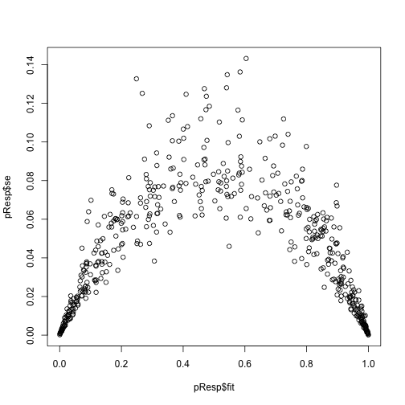 

```r

plot(pResp$fit, info2012$win)
```

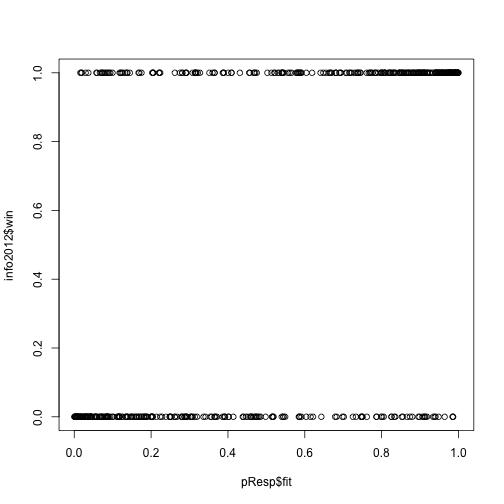 

```r

p <- seq(0, 1, by = 0.001)
idx <- rep(c(TRUE, FALSE), nrow(info2012)/2)

acc <- sapply(p, function(x) {
    i <- which(pResp$fit <= x)
    sum(info2012$win[i])/length(i)
})

acc[is.nan(acc) | acc == Inf] <- 0
plot(p, acc)
abline(a = 0, b = 1, col = "red")
```

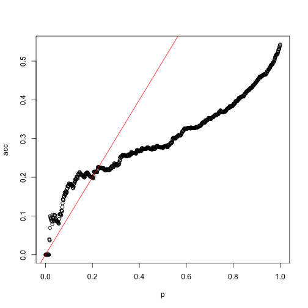 


```r

ilogit <- function(x) {
    exp(x)/(1 + exp(x))
}
paired <- sapply(which(idx), function(i) {
    logitA <- predict(fitStep, newdata = info2012[i, ])
    logitB <- predict(fitStep, newdata = info2012[i + 1, ])
    p1 <- ilogit(logitA - logitB)
    return(c(p1, 1 - p1))
})
paired <- as.vector(paired)

acc2 <- sapply(p, function(x) {
    i <- which(paired <= x)
    sum(info2012$win[i])/length(i)
})
acc2[is.nan(acc2) | acc2 == Inf] <- 0
plot(p, acc2)
abline(a = 0, b = 1, col = "red")
```

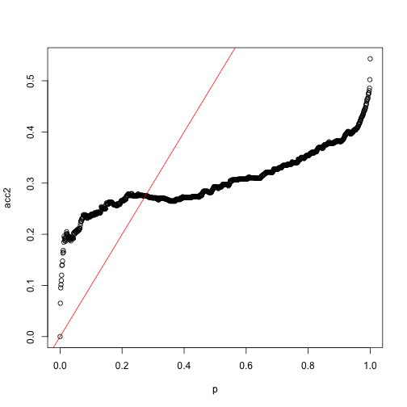 

```r

## Repeat with full model
paired2 <- sapply(which(idx), function(i) {
    logitA <- predict(fit, newdata = info2012[i, ])
    logitB <- predict(fit, newdata = info2012[i + 1, ])
    p1 <- ilogit(logitA - logitB)
    return(c(p1, 1 - p1))
})
paired2 <- as.vector(paired2)

acc3 <- sapply(p, function(x) {
    i <- which(paired2 <= x)
    sum(info2012$win[i])/length(i)
})
acc3[is.nan(acc3) | acc3 == Inf] <- 0
plot(p, acc3)
abline(a = 0, b = 1, col = "red")
```

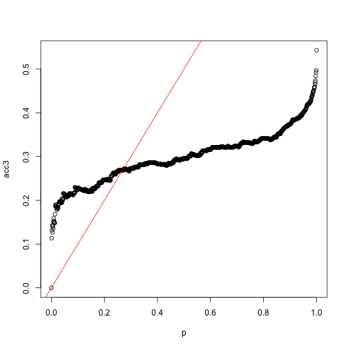 


I think that I might be doing something wrong, let me trace back


```r
plot(p, acc, ylim = range(c(acc, acc2, acc3)), type = "l", lwd = 2)
lines(p, acc2, col = "blue", lwd = 2)
lines(p, acc3, col = "orange", lwd = 2)
abline(a = 0, b = 1, col = "red")
```

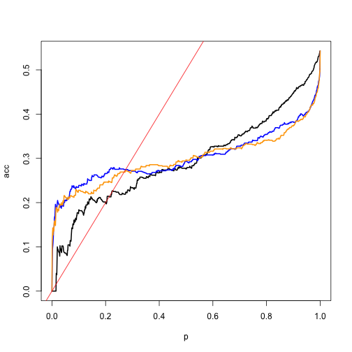 


```r

source("predFunctions.R")

## well, this is actually the same as 'paired' as shown a few lines below
pStep <- getPred(fitStep, info2012)

## Set number of bins
bin <- 30

## Yes, same as paired
pStep.eval <- evalPred(pStep, bin, info2012)
```

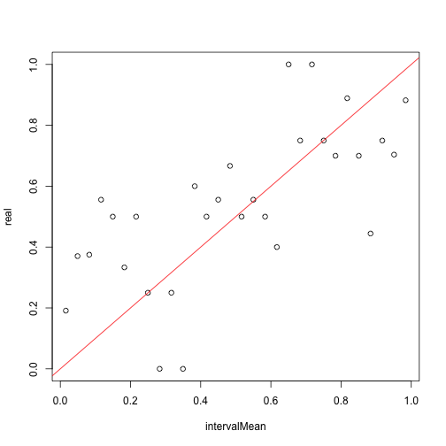 

```r
sum(evalPred(paired, bin, info2012, plot = FALSE)$real - pStep.eval$real)
```

```
## [1] 0
```

```r

pResp.eval <- evalPred(pResp$fit, bin, info2012)
```

 

```r
plot(pStep.eval$centers, pStep.eval$real - pResp.eval$real)
```

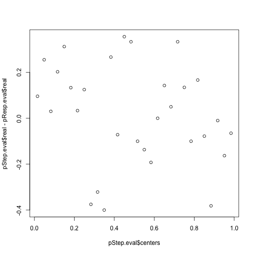 

```r

plot(pStep.eval$centers, pStep.eval$real, type = "o", col = "blue", ylim = c(0, 
    1))
lines(pStep.eval$centers, pResp.eval$real, type = "o", col = "orange")
abline(a = 0, b = 1, col = "red")
```

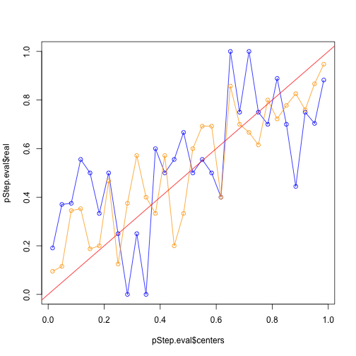 

```r

## Seems better to use regular predict() than to do the diffence in logits
## However, in such a case the probabilities don't add to 1!!!

hist(pResp$fit[idx] + pResp$fit[!idx])
```

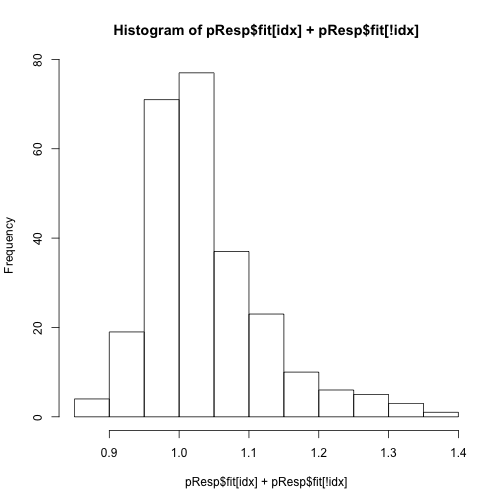 

```r
table(pStep[idx] + pStep[!idx])
```

```
## 
##   1 
## 256
```

```r


## What if I don't use the paired info?
check <- pStep[idx]
check.eval <- evalPred(check, bin, info2012[idx, ])
```

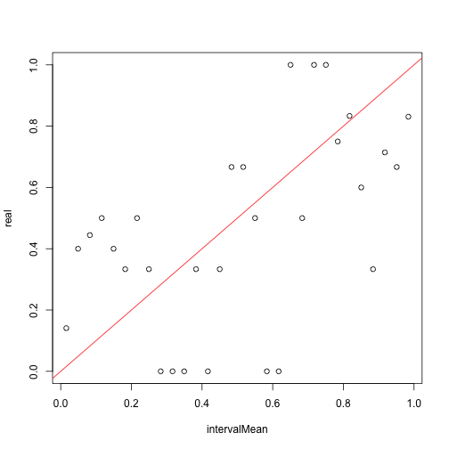 

```r

plot(pStep.eval$centers, pStep.eval$real, type = "o", col = "blue", ylim = c(0, 
    1))
lines(pStep.eval$centers, check.eval$real, type = "o", col = "orange")
abline(a = 0, b = 1, col = "red")
```

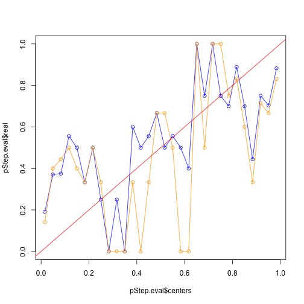 

```r
## Plot looks more jumpy, should be because of less data
```


Ok, now it looks like I got this right.


```r
## Re-train a model now with 2006 to 2012 data for predicting 2013 games

## Specify data to use when to train the model
gameFi2012 <- do.call(rbind, gameFirst[as.character(2006:2012)])

## Transform to factors so glm() won't complain
gameFi2012$teamA <- as.factor(gameFi2012$teamA)
gameFi2012$teamB <- as.factor(gameFi2012$teamB)

f2013 <- glm(win ~ teamAoPassYdsAtt + teamAoRun + teamAdPassYdsAtt + teamAdRunAtt + 
    teamBoRun + teamBoFumble + teamBdRunAtt + local + halfdiff + resumes + gwrA + 
    gwrB, family = binomial, data = gameFi2012)

## Lets look at it
summary(f2013)
```

```
## 
## Call:
## glm(formula = win ~ teamAoPassYdsAtt + teamAoRun + teamAdPassYdsAtt + 
##     teamAdRunAtt + teamBoRun + teamBoFumble + teamBdRunAtt + 
##     local + halfdiff + resumes + gwrA + gwrB, family = binomial, 
##     data = gameFi2012)
## 
## Deviance Residuals: 
##    Min      1Q  Median      3Q     Max  
## -2.737  -0.769   0.220   0.758   2.684  
## 
## Coefficients:
##                  Estimate Std. Error z value Pr(>|z|)    
## (Intercept)      -1.00691    1.44588   -0.70  0.48618    
## teamAoPassYdsAtt -0.11907    0.11130   -1.07  0.28469    
## teamAoRun         6.99838    1.68168    4.16  3.2e-05 ***
## teamAdPassYdsAtt  0.15090    0.11616    1.30  0.19390    
## teamAdRunAtt     -0.35006    0.08540   -4.10  4.1e-05 ***
## teamBoRun        -5.69035    1.65563   -3.44  0.00059 ***
## teamBoFumble     33.24616   10.14166    3.28  0.00104 ** 
## teamBdRunAtt      0.33947    0.08445    4.02  5.8e-05 ***
## localTRUE         0.27142    0.08452    3.21  0.00132 ** 
## halfdiff          0.14755    0.00558   26.47  < 2e-16 ***
## resumesTRUE       0.21977    0.08419    2.61  0.00904 ** 
## gwrA              0.73421    0.15718    4.67  3.0e-06 ***
## gwrB             -0.77118    0.15927   -4.84  1.3e-06 ***
## ---
## Signif. codes:  0 '***' 0.001 '**' 0.01 '*' 0.05 '.' 0.1 ' ' 1 
## 
## (Dispersion parameter for binomial family taken to be 1)
## 
##     Null deviance: 5037.3  on 3645  degrees of freedom
## Residual deviance: 3456.3  on 3633  degrees of freedom
##   (64 observations deleted due to missingness)
## AIC: 3482
## 
## Number of Fisher Scoring iterations: 5
```

```r

## Save the trained models
fits <- list(`2012` = fitStep, `2013` = f2013)
save(fits, file = "fits.Rdata", compress = "gzip")
```


