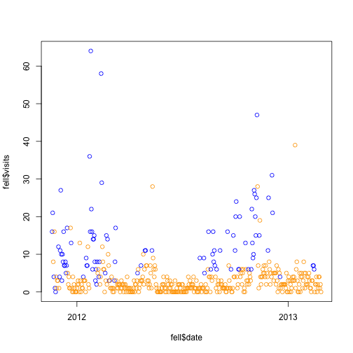
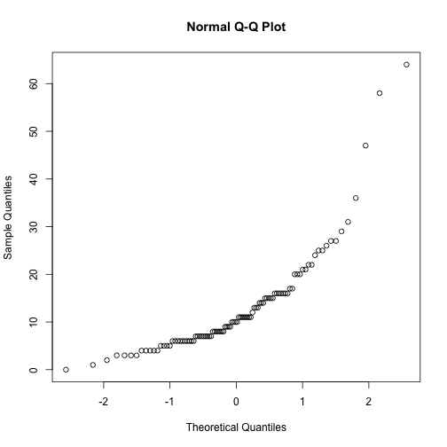
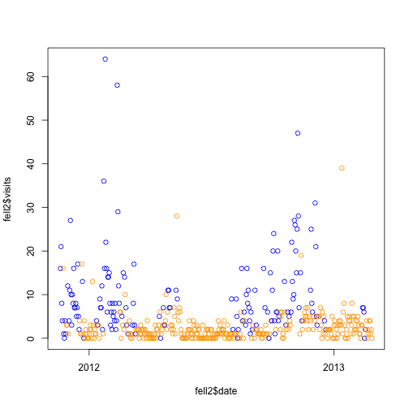
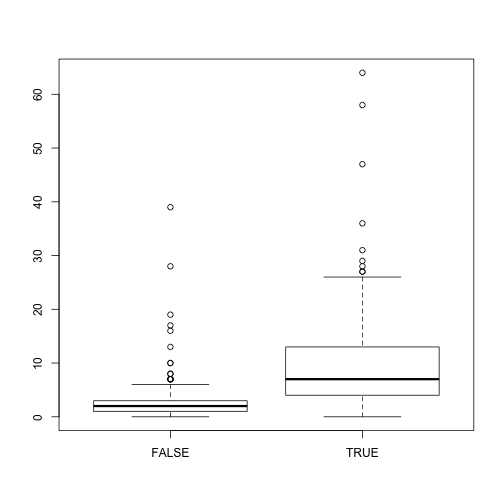
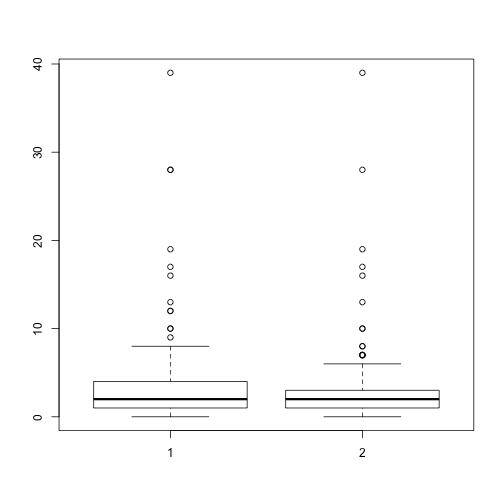

Exploring fellgernon.tumblr.com
===============================


```r
## Load data
load("../../data/fell.Rdata")

### Simple EDA

## Data over time
plot(fell$date, fell$visits, col = ifelse(fell$post, "blue", "orange"))
```

 

```r
tapply(fell$visit, fell$post, mean)
```

```
##  FALSE   TRUE 
##  2.737 13.031
```

```r

## Some 'FALSE' have high number of visits. Possibly carrying over from a
## post the day before.
boxplot(fell$visit ~ fell$post)
```

 

```r

## Diff in means in significant
t.test(fell$visit ~ fell$post)
```

```
## 
## 	Welch Two Sample t-test
## 
## data:  fell$visit by fell$post 
## t = -9.402, df = 103.4, p-value = 1.528e-15
## alternative hypothesis: true difference in means is not equal to 0 
## 95 percent confidence interval:
##  -12.465  -8.122 
## sample estimates:
## mean in group FALSE  mean in group TRUE 
##               2.737              13.031
```

```r

## Not normal looking
qqnorm(fell$visit[fell$post])
```

 

```r
qqnorm(fell$visit[!fell$post])
```

 

```r

## Lets compare days of the post and 2 days after vs rest
postDays <- function(df, day) {
    days <- df$date[df$post]
    new <- sapply(2:day, function(x) {
        days + x
    }, simplify = FALSE)
    all <- sort(c(days, do.call(c, new)))
    add <- data.frame(df$date %in% all)
    colnames(add) <- paste0("post", day)
    cbind(df, add)
}
## Marc days with posts (and the day after too)
fell2 <- postDays(fell, 2)

## View data
plot(fell2$date, fell2$visits, col = ifelse(fell2$post2, "blue", "orange"))
```

 

```r

## Visits are still different
boxplot(fell2$visit ~ fell2$post2)
```

 

```r

## Smaller difference than when comparing vs day of the post (see previous
## t.test)
t.test(fell2$visit ~ fell2$post2)
```

```
## 
## 	Welch Two Sample t-test
## 
## data:  fell2$visit by fell2$post2 
## t = -9.145, df = 167.6, p-value < 2.2e-16
## alternative hypothesis: true difference in means is not equal to 0 
## 95 percent confidence interval:
##  -9.236 -5.956 
## sample estimates:
## mean in group FALSE  mean in group TRUE 
##               2.457              10.053
```

```r

## Looks very similar for non post days vs also excluding day after post
boxplot(fell$visit[!fell$post], fell2$visit[!fell2$post2])
```

 

```r

## No significant diff in the mean for all non post days vs also excluding
## day after post
t.test(fell$visit[!fell$post], fell2$visit[!fell2$post2])
```

```
## 
## 	Welch Two Sample t-test
## 
## data:  fell$visit[!fell$post] and fell2$visit[!fell2$post2] 
## t = 1.001, df = 677.1, p-value = 0.3171
## alternative hypothesis: true difference in means is not equal to 0 
## 95 percent confidence interval:
##  -0.2688  0.8282 
## sample estimates:
## mean of x mean of y 
##     2.737     2.457
```

