Find Peaks
=========


```r
## Load data
load("../../data/simply.Rdata")
load("../../data/posts.controvery.proc.Rdata")  ## Typo on the name >.<

## Calculate running means by 5 days
runmeans <- data.frame(start = simply$date - 2, end = simply$date + 2, mean = rep(NA, 
    nrow(simply)))
for (i in 1:nrow(runmeans)) {
    runmeans$mean[i] <- mean(simply$v[simply$date >= runmeans$start[i] & simply$date <= 
        runmeans$end[i]])
}

## Some EDA on the running means
plot(simply$date, runmeans$mean)
```

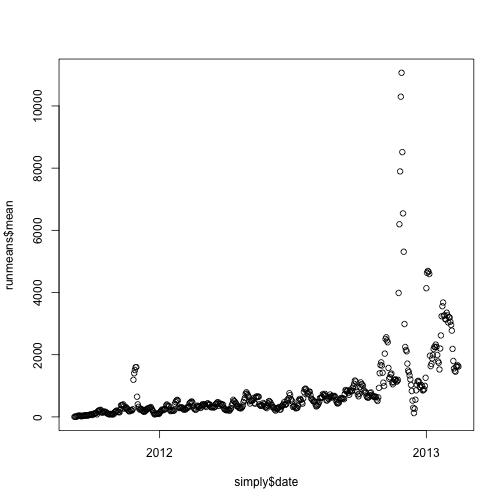 

```r
plot(simply$v, runmeans$mean)
```

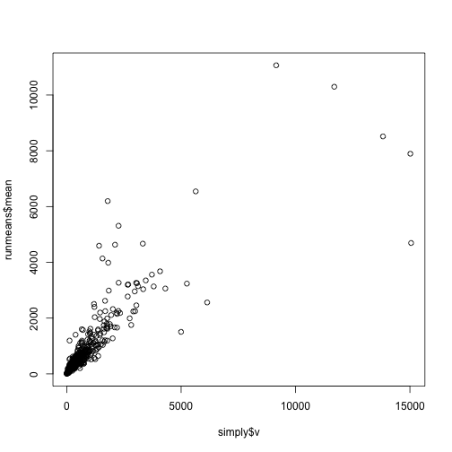 

```r
## This one looks useful to choose the peaks
plot(simply$v - runmeans$mean)
abline(h = 0, col = "red")
```

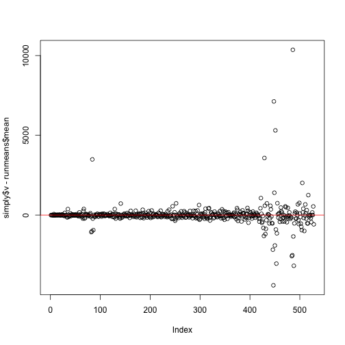 

```r

diff <- simply$v - runmeans$mean
plot(density(diff))
```

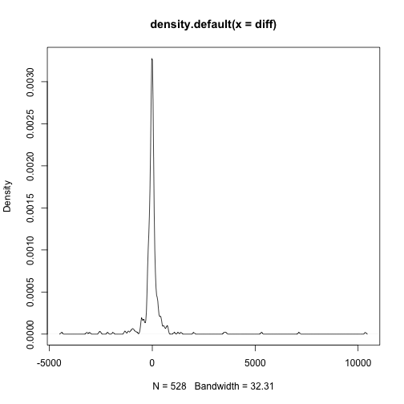 

```r
summary(diff)
```

```
##    Min. 1st Qu.  Median    Mean 3rd Qu.    Max. 
##   -4410    -109     -17       0      59   10400
```

```r
## Not normal
qqnorm(diff)
```

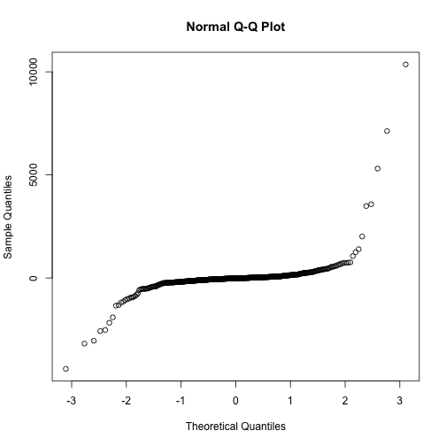 

```r

## Exploring the simply > 0 cutoff
plot(simply$date, simply$v, col = ifelse(diff > 0, "blue", "orange"))
```

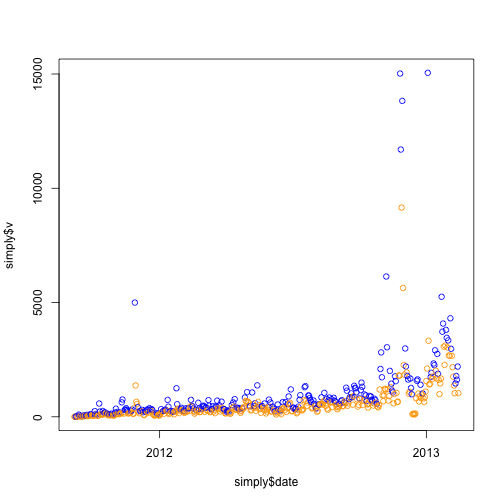 

```r
## It doesn't look great as some high values are marked in orange.  But in
## another sense, blue values are higher than orange ones.

## Looking at this in another way
boxplot(simply$v ~ diff > 0)
```

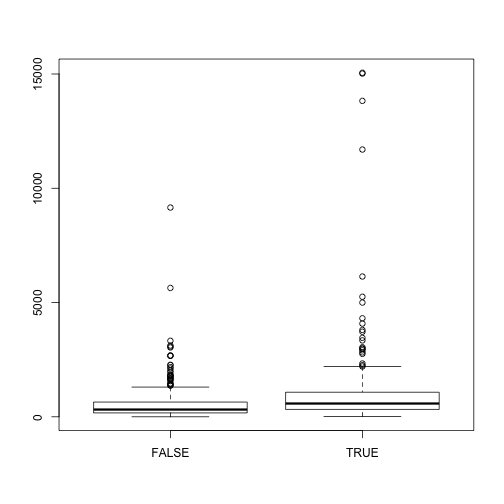 

```r
t.test(simply$v ~ diff > 0)
```

```
## 
## 	Welch Two Sample t-test
## 
## data:  simply$v by diff > 0 
## t = -3.897, df = 285.7, p-value = 0.0001213
## alternative hypothesis: true difference in means is not equal to 0 
## 95 percent confidence interval:
##  -815.1 -268.0 
## sample estimates:
## mean in group FALSE  mean in group TRUE 
##               572.1              1113.7
```

```r
## Good significant difference
table(diff > 0)
```

```
## 
## FALSE  TRUE 
##   301   227
```

```r

### Time to find a better cutoff.

## 3rd quantile?
plot(simply$date, simply$v, col = ifelse(diff > quantile(diff, 0.75), "blue", 
    "orange"))
```

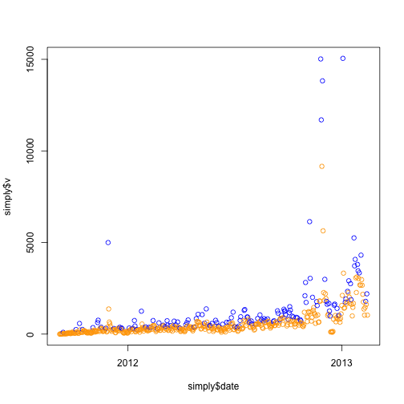 

```r
table(diff > quantile(diff, 0.75))
```

```
## 
## FALSE  TRUE 
##   396   132
```

```r

## .9 quantile?
plot(simply$date, simply$v, col = ifelse(diff > quantile(diff, 0.9), "blue", 
    "orange"))
```

 

```r
table(diff > quantile(diff, 0.9))
```

```
## 
## FALSE  TRUE 
##   475    53
```

```r
boxplot(simply$v ~ diff > quantile(diff, 0.9))
```

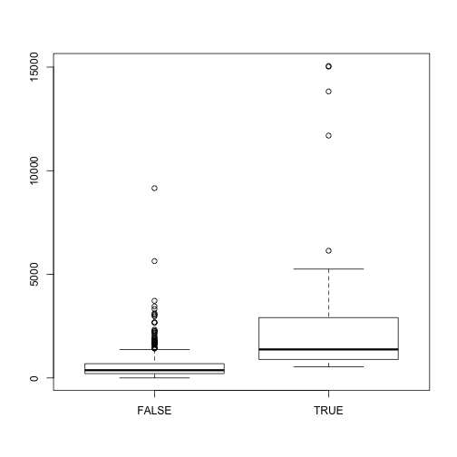 

```r
t.test(simply$v ~ diff > quantile(diff, 0.9))
```

```
## 
## 	Welch Two Sample t-test
## 
## data:  simply$v by diff > quantile(diff, 0.9) 
## t = -4.456, df = 52.53, p-value = 4.405e-05
## alternative hypothesis: true difference in means is not equal to 0 
## 95 percent confidence interval:
##  -3108 -1178 
## sample estimates:
## mean in group FALSE  mean in group TRUE 
##               589.8              2733.1
```

```r


## Lets take into accout the variation during the windows
runmeans$sd <- rep(NA, nrow(simply))
for (i in 1:nrow(runmeans)) {
    runmeans$sd[i] <- sd(simply$v[simply$date >= runmeans$start[i] & simply$date <= 
        runmeans$end[i]])
}

## Looks more 'Normal' as expected
plot((simply$v - runmeans$mean)/runmeans$sd)
```

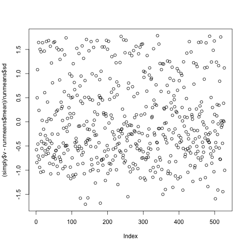 

```r

norm <- (simply$v - runmeans$mean)/runmeans$sd
qqnorm(norm)
qqline(norm, col = "red")
```

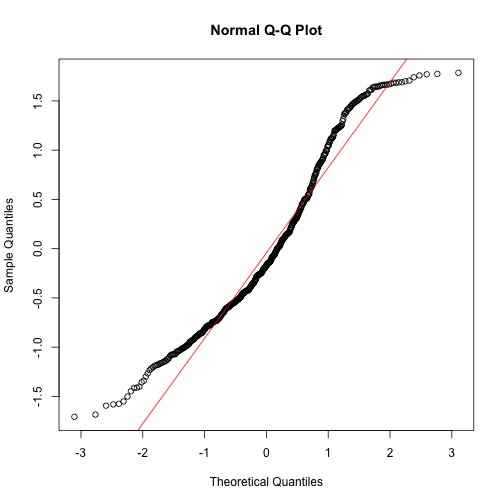 

