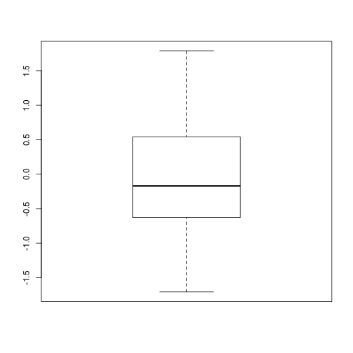
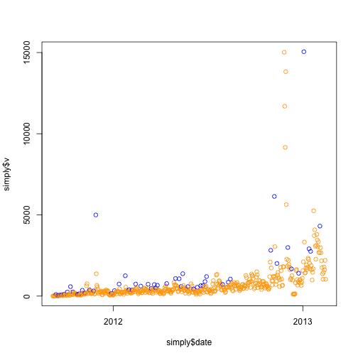
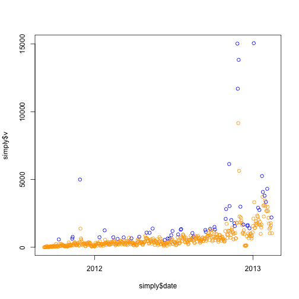
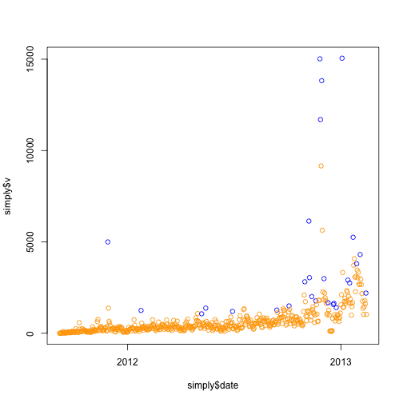

Find Peaks
=========


```r
## Load data
load("../../data/simply.Rdata")
load("../../data/posts.controversy.proc.Rdata")

## Calculate running means by 5 days I ran this with +-3 days and the
## results look worse in the sense that many peaks are next to each other.
runmeans <- data.frame(start = simply$date - 2, end = simply$date + 2, mean = rep(NA, 
    nrow(simply)))
for (i in 1:nrow(runmeans)) {
    runmeans$mean[i] <- mean(simply$v[simply$date >= runmeans$start[i] & simply$date <= 
        runmeans$end[i]])
}

## Some EDA on the running means
plot(simply$date, runmeans$mean)
```

 

```r
plot(simply$v, runmeans$mean)
```

 

```r
## This one looks useful to choose the peaks
plot(simply$v - runmeans$mean)
abline(h = 0, col = "red")
```

 

```r

diff <- simply$v - runmeans$mean
plot(density(diff))
```

 

```r
summary(diff)
```

```
##    Min. 1st Qu.  Median    Mean 3rd Qu.    Max. 
##   -4410    -109     -17       0      59   10400
```

```r
## Not normal
qqnorm(diff)
```

 

```r

## Exploring the simply > 0 cutoff
plot(simply$date, simply$v, col = ifelse(diff > 0, "blue", "orange"))
```

 

```r
## It doesn't look great as some high values are marked in orange.  But in
## another sense, blue values are higher than orange ones.

## Looking at this in another way
boxplot(simply$v ~ diff > 0)
```

 

```r
t.test(simply$v ~ diff > 0)
```

```
## 
## 	Welch Two Sample t-test
## 
## data:  simply$v by diff > 0 
## t = -3.897, df = 285.7, p-value = 0.0001213
## alternative hypothesis: true difference in means is not equal to 0 
## 95 percent confidence interval:
##  -815.1 -268.0 
## sample estimates:
## mean in group FALSE  mean in group TRUE 
##               572.1              1113.7
```

```r
## Good significant difference
table(diff > 0)
```

```
## 
## FALSE  TRUE 
##   301   227
```

```r

### Time to find a better cutoff.

## 3rd quantile?
plot(simply$date, simply$v, col = ifelse(diff > quantile(diff, 0.75), "blue", 
    "orange"))
```

 

```r
table(diff > quantile(diff, 0.75))
```

```
## 
## FALSE  TRUE 
##   396   132
```

```r

## .9 quantile?
plot(simply$date, simply$v, col = ifelse(diff > quantile(diff, 0.9), "blue", 
    "orange"))
```

 

```r
table(diff > quantile(diff, 0.9))
```

```
## 
## FALSE  TRUE 
##   475    53
```

```r
boxplot(simply$v ~ diff > quantile(diff, 0.9))
```

 

```r
t.test(simply$v ~ diff > quantile(diff, 0.9))
```

```
## 
## 	Welch Two Sample t-test
## 
## data:  simply$v by diff > quantile(diff, 0.9) 
## t = -4.456, df = 52.53, p-value = 4.405e-05
## alternative hypothesis: true difference in means is not equal to 0 
## 95 percent confidence interval:
##  -3108 -1178 
## sample estimates:
## mean in group FALSE  mean in group TRUE 
##               589.8              2733.1
```

```r


## Lets take into accout the variation during the windows
runmeans$sd <- rep(NA, nrow(simply))
for (i in 1:nrow(runmeans)) {
    runmeans$sd[i] <- sd(simply$v[simply$date >= runmeans$start[i] & simply$date <= 
        runmeans$end[i]])
}

## Looks more 'Normal' as expected
plot((simply$v - runmeans$mean)/runmeans$sd)
```

 

```r

norm <- (simply$v - runmeans$mean)/runmeans$sd
qqnorm(norm)
qqline(norm, col = "red")
```

 

```r
## Hard to interpret T_T'

## Boxplot looks symmetric
boxplot(norm)
```

 

```r

## Shapiro Test (shouldn't take it's results much into account) indicate
## that it's not normal
shapiro.test(norm)
```

```
## 
## 	Shapiro-Wilk normality test
## 
## data:  norm 
## W = 0.9548, p-value = 1.215e-11
```

```r

## Summary info
summary(norm)
```

```
##    Min. 1st Qu.  Median    Mean 3rd Qu.    Max. 
## -1.7100 -0.6280 -0.1700 -0.0031  0.5410  1.7900
```

```r

## Surprinsingly bad results!
plot(simply$date, simply$v, col = ifelse(norm > quantile(norm, 0.9), "blue", 
    "orange"))
```

 


Taking a step back and looking at how the peaks would be using the quantile 0.9 for diff.


```r
plot(simply$date, simply$v, col = ifelse(diff > quantile(diff, 0.9), "blue", 
    "orange"))
```

 

```r
## Looks like some peaks are too close to each other
diff(simply$date[diff > quantile(diff, 0.9)])
```

```
## Time differences in days
##  [1] 31  1 17 45 12 20 10 14 18 18 17  7  7 28  7  4  4  3 13  6  1 26  3
## [24] 27  1 10 10  1 25  1  7  1  4  7  1  6  1  2  4  7  9  1  4 10 10  3
## [47]  6  2  4  3  3 10
```

```r
## 69 posts in those peak days out of 511 total
dim(posts[posts$date %in% simply$date[diff > quantile(diff, 0.9)], ])
```

```
## [1] 69  7
```

```r

## It's 10% days vs 13.5% posts
sum(diff > quantile(diff, 0.9))/length(diff)
```

```
## [1] 0.1004
```

```r
69/nrow(posts)
```

```
## [1] 0.135
```

```r

plot(simply$date, simply$v, col = ifelse(diff > quantile(diff, 0.95), "blue", 
    "orange"))
```

 

```r

```


Looking at differences between the authors

```r

## Ahh, is the controversy related to the author?
tapply(posts$cont, posts$author, mean)
```

```
##           admin       Jeff Leek Rafael Irizarry      Roger Peng 
##           1.500           1.536           1.681           1.724 
## Steven Salzberg 
##           2.500
```

```r
with(posts, boxplot(cont ~ factor(author)))
```

 

```r
f <- lm(cont ~ factor(author), data = posts)
summary(f)
```

```
## 
## Call:
## lm(formula = cont ~ factor(author), data = posts)
## 
## Residuals:
##    Min     1Q Median     3Q    Max 
## -0.724 -0.681 -0.536  0.464  3.464 
## 
## Coefficients:
##                               Estimate Std. Error t value Pr(>|t|)  
## (Intercept)                     1.5000     0.9087    1.65    0.099 .
## factor(author)Jeff Leek         0.0359     0.9110    0.04    0.969  
## factor(author)Rafael Irizarry   0.1813     0.9144    0.20    0.843  
## factor(author)Roger Peng        0.2244     0.9107    0.25    0.805  
## factor(author)Steven Salzberg   1.0000     1.2851    0.78    0.437  
## ---
## Signif. codes:  0 '***' 0.001 '**' 0.01 '*' 0.05 '.' 0.1 ' ' 1 
## 
## Residual standard error: 0.909 on 506 degrees of freedom
## Multiple R-squared: 0.011,	Adjusted R-squared: 0.00319 
## F-statistic: 1.41 on 4 and 506 DF,  p-value: 0.23
```

```r
anova(f)
```

```
## Analysis of Variance Table
## 
## Response: cont
##                 Df Sum Sq Mean Sq F value Pr(>F)
## factor(author)   4      5   1.163    1.41   0.23
## Residuals      506    418   0.826
```

```r
## pvalue of 0.2301 hmm
f2 <- lm(cont ~ factor(author), data = posts, subset = author %in% c("Jeff Leek", 
    "Rafael Irizarry", "Roger Peng"))
summary(f2)
```

```
## 
## Call:
## lm(formula = cont ~ factor(author), data = posts, subset = author %in% 
##     c("Jeff Leek", "Rafael Irizarry", "Roger Peng"))
## 
## Residuals:
##    Min     1Q Median     3Q    Max 
## -0.724 -0.681 -0.536  0.464  3.464 
## 
## Coefficients:
##                               Estimate Std. Error t value Pr(>|t|)    
## (Intercept)                     1.5359     0.0651   23.60   <2e-16 ***
## factor(author)Rafael Irizarry   0.1454     0.1207    1.20    0.229    
## factor(author)Roger Peng        0.1885     0.0881    2.14    0.033 *  
## ---
## Signif. codes:  0 '***' 0.001 '**' 0.01 '*' 0.05 '.' 0.1 ' ' 1 
## 
## Residual standard error: 0.909 on 506 degrees of freedom
## Multiple R-squared: 0.00925,	Adjusted R-squared: 0.00533 
## F-statistic: 2.36 on 2 and 506 DF,  p-value: 0.0953
```

```r
anova(f2)
```

```
## Analysis of Variance Table
## 
## Response: cont
##                 Df Sum Sq Mean Sq F value Pr(>F)  
## factor(author)   2      4   1.950    2.36  0.095 .
## Residuals      506    418   0.826                 
## ---
## Signif. codes:  0 '***' 0.001 '**' 0.01 '*' 0.05 '.' 0.1 ' ' 1
```

```r
## Ok, now Roger's posts seem different!!

## Lets look at the Jeff vs Rafa vs Roger
table(posts$author)
```

```
## 
##           admin       Jeff Leek Rafael Irizarry      Roger Peng 
##               1             195              80             234 
## Steven Salzberg 
##               1
```

```r
posts.filt <- subset(posts, author %in% c("Jeff Leek", "Rafael Irizarry", "Roger Peng"))
t.test(posts.filt$cont ~ posts.filt$author == "Roger Peng")
```

```
## 
## 	Welch Two Sample t-test
## 
## data:  posts.filt$cont by posts.filt$author == "Roger Peng" 
## t = -1.796, df = 478, p-value = 0.07321
## alternative hypothesis: true difference in means is not equal to 0 
## 95 percent confidence interval:
##  -0.3062  0.0138 
## sample estimates:
## mean in group FALSE  mean in group TRUE 
##               1.578               1.724
```

```r
t.test(posts.filt$cont ~ posts.filt$author == "Jeff Leek")
```

```
## 
## 	Welch Two Sample t-test
## 
## data:  posts.filt$cont by posts.filt$author == "Jeff Leek" 
## t = 2.21, df = 450.9, p-value = 0.02764
## alternative hypothesis: true difference in means is not equal to 0 
## 95 percent confidence interval:
##  0.01963 0.33533 
## sample estimates:
## mean in group FALSE  mean in group TRUE 
##               1.713               1.536
```

```r
t.test(posts.filt$cont ~ posts.filt$author == "Rafael Irizarry")
```

```
## 
## 	Welch Two Sample t-test
## 
## data:  posts.filt$cont by posts.filt$author == "Rafael Irizarry" 
## t = -0.3688, df = 107, p-value = 0.713
## alternative hypothesis: true difference in means is not equal to 0 
## 95 percent confidence interval:
##  -0.2713  0.1862 
## sample estimates:
## mean in group FALSE  mean in group TRUE 
##               1.639               1.681
```

```r
## Only Jeff is significantly different from the other 2. I mean, Jeff vs
## (Roger + Rafa).
```


