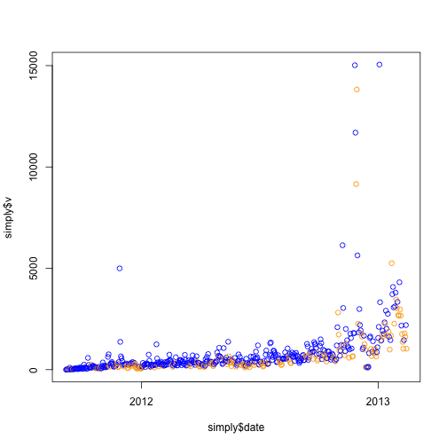
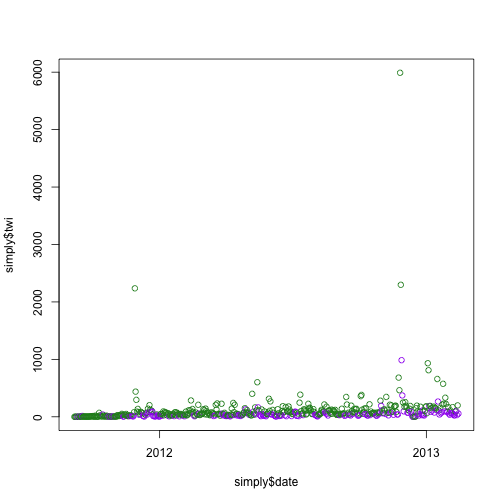
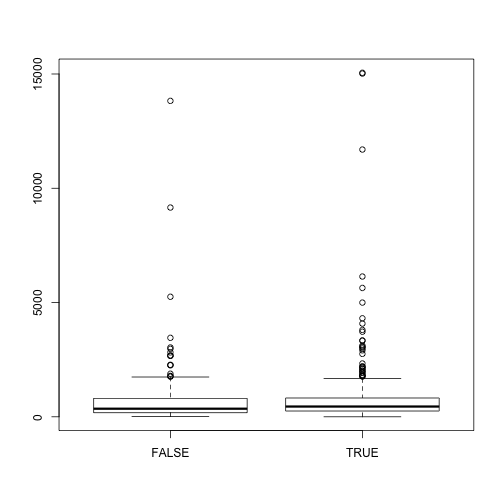
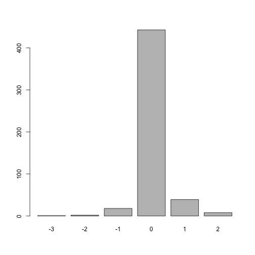
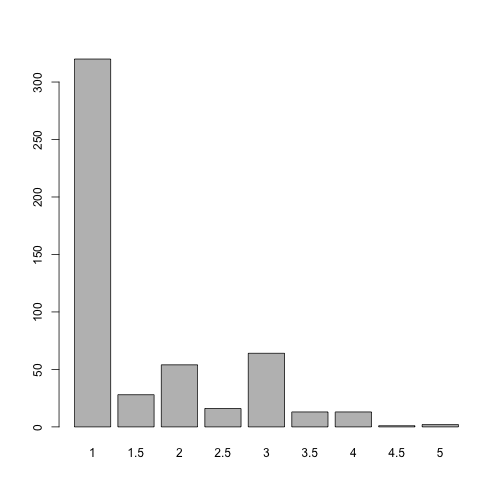

Exploring the simplystats data
==============================


```r
## Load data
load("../../data/simply.Rdata")
load("../../data/posts.controversy.Rdata")

## Basic exploration
summary(simply)
```

```
##       date                 vTum           vWP            twiTum      
##  Min.   :2011-09-06   Min.   :   0   Min.   :    0   Min.   :   0.0  
##  1st Qu.:2012-01-15   1st Qu.: 153   1st Qu.:    0   1st Qu.:   7.0  
##  Median :2012-05-26   Median : 306   Median :    0   Median :  35.0  
##  Mean   :2012-05-26   Mean   : 430   Mean   :  375   Mean   :  59.8  
##  3rd Qu.:2012-10-05   3rd Qu.: 560   3rd Qu.:    0   3rd Qu.:  75.2  
##  Max.   :2013-02-14   Max.   :6138   Max.   :14885   Max.   :2237.0  
##      twiWP            v              twi          post        
##  Min.   :   0   Min.   :    0   Min.   :   0   Mode :logical  
##  1st Qu.:   0   1st Qu.:  229   1st Qu.:  23   FALSE:159      
##  Median :   0   Median :  416   Median :  51   TRUE :369      
##  Mean   :  43   Mean   :  805   Mean   : 102   NA's :0        
##  3rd Qu.:   0   3rd Qu.:  811   3rd Qu.: 104                  
##  Max.   :5985   Max.   :15052   Max.   :5989
```

```r
summary(posts)
```

```
##       date               author             title          
##  Min.   :2011-09-06   Length:511         Length:511        
##  1st Qu.:2011-12-06   Class :character   Class :character  
##  Median :2012-04-18   Mode  :character   Mode  :character  
##  Mean   :2012-04-26                                        
##  3rd Qu.:2012-08-28                                        
##  Max.   :2013-02-18                                        
##      type                leo1           leo2     
##  Length:511         Min.   :1.00   Min.   :1.00  
##  Class :character   1st Qu.:1.00   1st Qu.:1.00  
##  Mode  :character   Median :1.00   Median :1.00  
##                     Mean   :1.62   Mean   :1.56  
##                     3rd Qu.:2.00   3rd Qu.:2.00  
##                     Max.   :5.00   Max.   :5.00
```

```r

## Visits vs time
plot(simply$date, simply$v, col = ifelse(simply$post, "blue", "orange"))
```

 

```r

## Twitter visits vs time
plot(simply$date, simply$twi, col = ifelse(simply$post, "forest green", "purple"))
```

 

```r

## No difference in the mean number of visitors for days with posts vs
## without
boxplot(simply$v ~ simply$post)
```

 

```r
t.test(simply$v ~ simply$post)
```

```
## 
## 	Welch Two Sample t-test
## 
## data:  simply$v by simply$post 
## t = -0.0455, df = 295.6, p-value = 0.9637
## alternative hypothesis: true difference in means is not equal to 0 
## 95 percent confidence interval:
##  -279.9  267.3 
## sample estimates:
## mean in group FALSE  mean in group TRUE 
##               800.6               806.9
```

```r

## Looking at how I ranked the controversy of the posts
t.test(posts$leo1, posts$leo2, paired = TRUE)
```

```
## 
## 	Paired t-test
## 
## data:  posts$leo1 and posts$leo2 
## t = 2.936, df = 510, p-value = 0.00348
## alternative hypothesis: true difference in means is not equal to 0 
## 95 percent confidence interval:
##  0.01942 0.09800 
## sample estimates:
## mean of the differences 
##                 0.05871
```

```r
barplot(table(posts$leo1 - posts$leo2))
```

 

```r

## Mean controvery ranking
posts$leo2 <- as.integer(posts$leo2)
posts$cont <- rowMeans(posts[, c("leo1", "leo2")])

## Exploring the mean controversy ranking
barplot(table(posts$cont))
```

 

```r

## Save posts for later use
save(posts, file = "../../data/posts.controversy.proc.Rdata", compress = "gzip")
```


